---
output:
  html_document:
    keep_md: true
params:
  ID: ''
editor_options: 
  markdown: 
    wrap: 72
---

------------------------------------------------------------------------


# 1. Setup

## 1.1 Site Selection

Add the target water body abbreviation for the site of interest. This
Rmd is currently set up for all of the GRYN sites, but adding any USGS
stream gage sites by adding a row with the site info into the
`AddedSites` matrix below.

*REQUIRED*: **Manually enter the abbreviation for the GRYN site of
interest**. Options are SNR1, SNR2, YRCS, LMR, MDR, SBC, SHR, BHR1, and BHR2.


```r
#### MANUALLY Identify which siteID you want to use:
# site <- params$ID
site <- "YRCS"
```

NOTE ON AUTOMATION:

To automate running this R markdown for multiple different gages at
once, you can use the YAML header (the top part of this script with the
dashed lines above and below) and some helper code run in either the
console or saved as a separate R script.

Parameters can be included in the YAML header under `params`. The
parameters can then be called in the rest of the script using
`params$<parameter name>`, which allows for automation. In this case, we
are specifying a parameter named ID, which will then fill in the site
with a different ID each time the R markdown is run (using some helper
code).

In this case, writing a simple external loop through IDs that match the
SiteIDs contained in the stream gage matrix (Section 1.3) facilitates
automating this process. Below is an example, which would be run in the
R console or saved as a separate R script. The first line sets up the
loop so that each site can be iterated through. Then we use the function
`render` from `rmarkdown`, which tells R to render the `input` Rmd each
time with a different parameter. We then can specify the output file
name and output directory.


```r
for (i in streamgages$Site) {
 rmarkdown::render(input = "flowtrends.Rmd", 
                    params = list(ID = i),
                    output_file=paste0(i),
                    output_dir = ".")
}
```

## 1.2 Load Packages

First install and load the packages for analysis (they are all cited in
the references). The following packages are required: `dataRetrieval`
which will access the stream gage data available on NWIS and `EGRET`
which will support the flow graphing/trend line functions. The
`flowTrends.R` script is adapted from Hirsch, R.M., 2018 (updated 2023)
"Daily Streamflow Trend Analysis." The `tidyverse` contains `dplyr`
(part of the tidyverse) which will filter out provisional values in
Section 1.4 if this is desired for the analysis. It also contaisn
`ggplot` and other supporting packages for visualization. `rkt` runs the
Mann-Kendall tests with `zyp` to adjust for serial correlation (code
from Hirsch, R.M., 2018). `quantreg` enables the quantile regressions on
daily discharges (should not be used for reports, but saved for
reference on what not to run). The other packages are for formatting.
The below chunk will check to see if you have these packages on your OS.
If you do not, it will install the packages you do not have. It then
loads all of them. The packages are cited in the references.


## 1.3 Set up GRYN Site Matrix for Ease of Re-using this .Rmd

Now let's get ready to make an EGRET object. For ease of quickly reusing
this Rmd for different sites, a tibble of the GRYN sites has been
created. The final chunk filters the tibble by the site abbreviation
specified above and saves the corresponding info for setting up the
EGRET object. No start/end dates are provided in the matrix because
EGRET automatically will add start/end dates from the record the stream
gage discharge data if none are provided. This will keep the data as
current as possible each time the code is run.

*OPTIONAL*: As stated above, other non-GRYN sites could easily be
manually added to the AddedSites matrix below the last entry.


## 1.4 Set up EGRET object

The next code chunk prepares the gage ID and site name based on the
abbreviation you manually entered in Section 1.1. Then, the
dataRetrieval package reads in the `Daily` stream gage data available
online from NWIS! Next, it will read in the info available for this
gage, also from NWIS (`INFO`). Currently, the argument
`interactive = FALSE` is used to avoid being prompted by the program to
enter the info interactively.

*OPTIONAL*: If you only want figures with data that is only USGS
approved, the `dplyr::filter` will remove any of the provisional data.
ALSO, the arguments within the function `setPA()` can be altered to
display a particular season or time period of interest. Currently,
`paStart` is set to 10, meaning the record starts in October, and
`paLong` is set to 12, meaning that the record will include all 12
months following water year conventions. These values could be changed
to 1 and 12 respectively if you want the calendar year summaries
(January to December), or 3 and 4 respectively if you wanted March
through June, and so on.


```
## There are 41338 data points, and 41339 days.
## 
##  discharge data jumps from 2024-02-04 to 2024-02-06
```

# 2. Historical Flow

## 2.1 Historical Flow Percentiles

The historical percentiles of daily discharge are provided in CFS first
to get an idea of the general distribution of the data.


```
## 
## Flow Duration for YRCS 
## 
## Flow duration is based on full year
## 
## Discharge units are Cubic Feet per Second
```

<table class="table" style="width: auto !important; margin-left: auto; margin-right: auto;">
<caption>Historical Flow Percentiles for Yellowstone River at Corwin Springs</caption>
 <thead>
  <tr>
   <th style="text-align:left;">   </th>
   <th style="text-align:right;"> Discharge (cfs) </th>
  </tr>
 </thead>
<tbody>
  <tr>
   <td style="text-align:left;"> min </td>
   <td style="text-align:right;"> 380 </td>
  </tr>
  <tr>
   <td style="text-align:left;"> 5% </td>
   <td style="text-align:right;"> 660 </td>
  </tr>
  <tr>
   <td style="text-align:left;"> 10% </td>
   <td style="text-align:right;"> 760 </td>
  </tr>
  <tr>
   <td style="text-align:left;"> 25% </td>
   <td style="text-align:right;"> 960 </td>
  </tr>
  <tr>
   <td style="text-align:left;"> 50% </td>
   <td style="text-align:right;"> 1400 </td>
  </tr>
  <tr>
   <td style="text-align:left;"> 75% </td>
   <td style="text-align:right;"> 3450 </td>
  </tr>
  <tr>
   <td style="text-align:left;"> 90% </td>
   <td style="text-align:right;"> 8580 </td>
  </tr>
  <tr>
   <td style="text-align:left;"> 95% </td>
   <td style="text-align:right;"> 11700 </td>
  </tr>
  <tr>
   <td style="text-align:left;"> max </td>
   <td style="text-align:right;"> 47200 </td>
  </tr>
</tbody>
</table>

## 2.2 Historical Flow Hydrograph

The below hydrograph displays the current year vs. the mean, 25th, and
75th percentiles from the entire record.

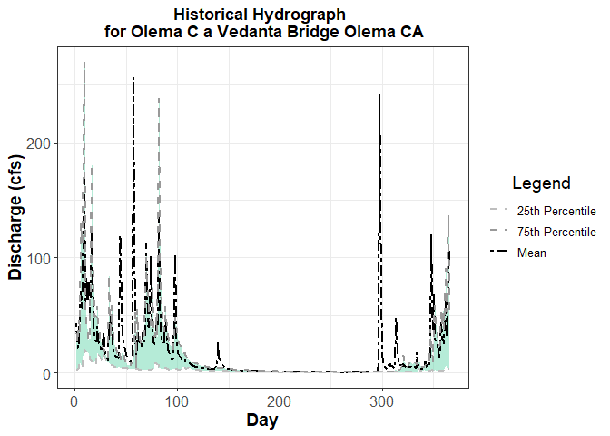<!-- -->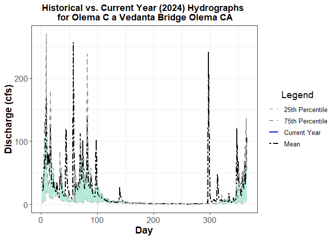<!-- -->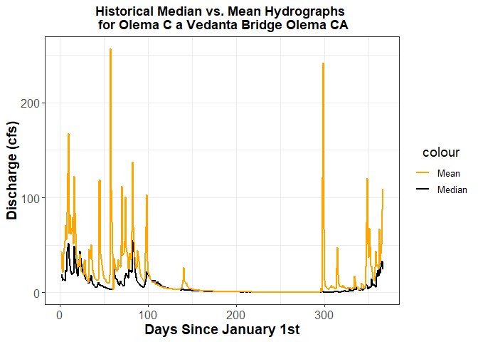<!-- -->

Annual figures:

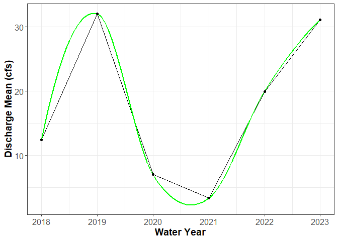<!-- -->

## 2.3 Flow Duration Curves

The flow duration curve (FDC) is shown below. According to the USGS, the
shape of the curves reveal information about the watershed. Steep slopes
throughout indicate high stream variability impacted primarily by
runoff, while flatter slopes generally indicate that the flow is
equalized by storage in surface water or groundwater (Searcy, 1959).
Flat slopes at low flow end and high flow ends of the FDC also are
informative about the stream characteristics. If the stream stores a lot
of water, flat slopes at the low flow end are expected. If the slope is
flat at the high end, this generally indicates flow from snowmelt, flood
plains, or swamp drainage (Searcy, 1959).

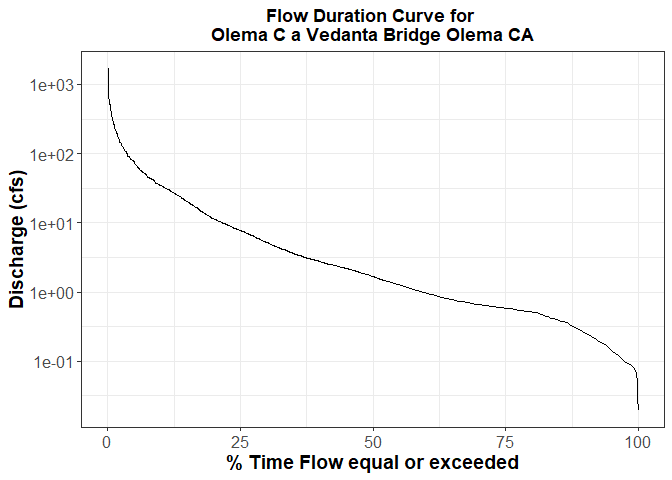<!-- -->

# 3. EGRET Discharge Plots for Water Year (October 1st - September 30th)


## 3.1 EGRET Discharge Plots

The data will now be plotted to examine possible long term trends in
discharge! The EGRET function `plotFourStats()` and a modified version
of that function, `plotFourAny()` will be used so that all 8 available
discharge stats can be displayed (Table 2). According to the EGRET
documentation (Hirsch & De Cicco, 2015), these statistics are calculated
based on the first day provided for `paStart` and go through every day
until the the last day of `paLong` months from the start. So, if you
told EGRET you wanted the period March-June, the statistics are returned
for this time period. **Please note, according to the EGRET
documentation,** there is an exception for the water year statistics.
All of the minimums (i.e. 1-day minimum) for the water year plots are
noted in EGRET to be calculated using climate year (April 1-March 31) to
minimize droughts spanning multiple water years.

<table class="table" style="margin-left: auto; margin-right: auto;">
<caption>Available EGRET istats.</caption>
 <thead>
  <tr>
   <th style="text-align:left;"> istat </th>
   <th style="text-align:left;"> Discharge Statistic Name </th>
  </tr>
 </thead>
<tbody>
  <tr>
   <td style="text-align:left;"> 1 </td>
   <td style="text-align:left;"> Annual minimum 1-day daily discharge </td>
  </tr>
  <tr>
   <td style="text-align:left;"> 2 </td>
   <td style="text-align:left;"> Annual minimum 7-day mean of the daily discharges </td>
  </tr>
  <tr>
   <td style="text-align:left;"> 3 </td>
   <td style="text-align:left;"> Annual minimum 30-day mean of the daily discharges </td>
  </tr>
  <tr>
   <td style="text-align:left;"> 4 </td>
   <td style="text-align:left;"> Annual median of the daily discharges </td>
  </tr>
  <tr>
   <td style="text-align:left;"> 5 </td>
   <td style="text-align:left;"> Annual mean of the daily discharges </td>
  </tr>
  <tr>
   <td style="text-align:left;"> 6 </td>
   <td style="text-align:left;"> Annual maximum 30-day mean of the daily discharges </td>
  </tr>
  <tr>
   <td style="text-align:left;"> 7 </td>
   <td style="text-align:left;"> Anuual maximum 7-day mean of the daily discharges </td>
  </tr>
  <tr>
   <td style="text-align:left;"> 8 </td>
   <td style="text-align:left;"> Annual maximum 1-day daily discharges </td>
  </tr>
</tbody>
</table>

Summarized from the EGRET documentation (Hirsch & De Cicco, 2015):

The lines shown in these plots are computed using locally weighted
scatter plot smoothing (lowess) for time-series. This approach smooths
out the time series data (annual) so trends can be visualized at longer
time spans (more than a decade). The trend lines resist the presence of
a few extremes, but the user should take caution, as this means that
sudden changes in a stream may be smoothed away. To quickly summarize
what is occurring during the smoothing process: the annual discharge
statistics are transformed to a log-scale (ln). This deals with right
skewness, often present in discharge data, as extremes tend to be from
high flows. Weighted regressions are performed for each year's discharge
statistics. The weight applied to each discharge value in each
regression depends on the year -- for example, if the regression is
being performed for 2001 mean discharge, the 2001 mean discharge has the
highest weight, and the weights applied to discharges within a 30 year
window decay as they get further in time away. Therefore, for short time
periods (\~30 years) a lot of the trend lines will look like straight
lines or very smooth curves. Those outside the window have no weight.
The windows are by default widened for the ends of the record, because
there is more data available on one side of the end values than the
other side. The discharge is then re-transformed back from the log
scale, resulting in the smooth trend lines. The technique is usually
ideal for a total record length of 50+ years, but can also be applied to
shorter records.

The code for this is sourced in the flowTrends.R file in Section 1.1 and
was copied from the EGRET page on USGS via [this
site](https://rconnect.usgs.gov/EGRET/articles/streamflow_trend.html#making-a-graph-of-the-trend-in-a-single-flow-statistic)
(Hirsch, R.M., 2018 (updated 2023), Daily Streamflow Trend Analysis).
The plots also give a trend slope (calculated by Theil-Sen Estimator,
linear for univariate time-series) in % per year with a p-value estimate
based on Mann-Kendall, adjusted for year to year serial correlation
(common in time-series).

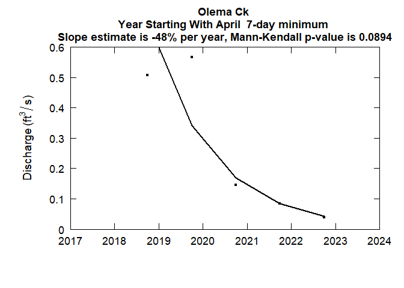<!-- -->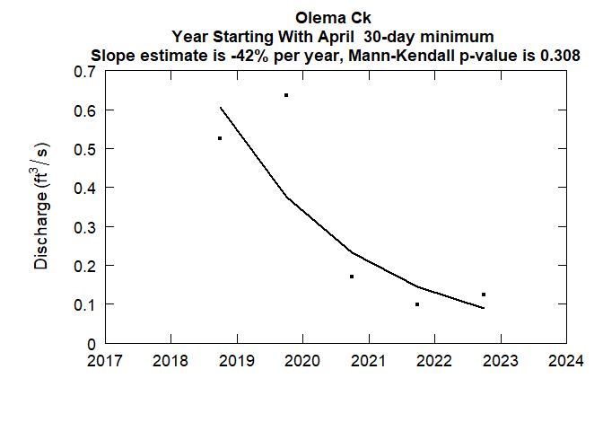<!-- -->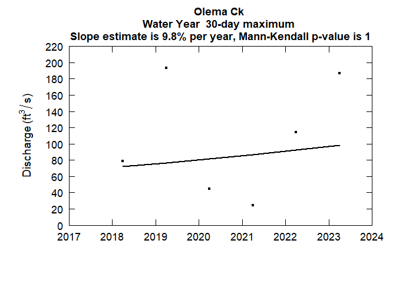<!-- --><!-- -->

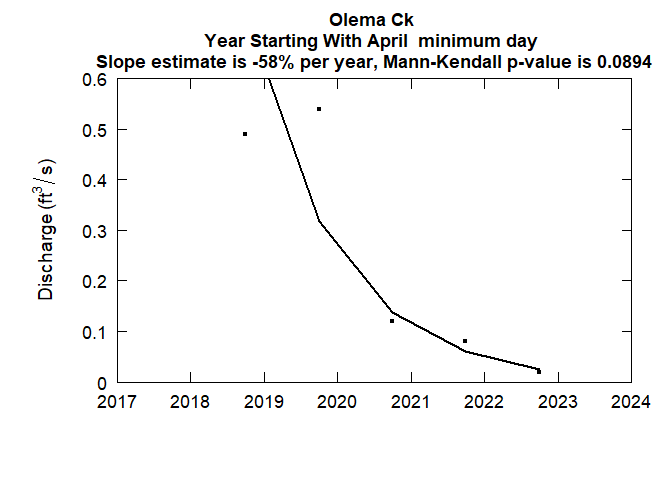<!-- --><!-- --><!-- --><!-- -->

## 3.2 Standard Deviation Plot of the Daily Mean (Log)

This plot helps to assess the variability of the data set over time
(Hirsch & De Cicco, 2015). It takes the standard deviation of the log of
the annual mean daily discharge (Q), resulting in a dimensionless
statistic. This is useful information for observing potential trends in
variability over time. For example, if the result of plotting the
standard deviation over time is an upward trending curve, this suggests
that there is more change in the high or low end of the distribution
than the middle. The results may inform whether changing conditions are
changing flow variability, such as more extreme precipitation events
combined with more periods of prolonged heat/drought from a changing
climate. The default window is 15 years.

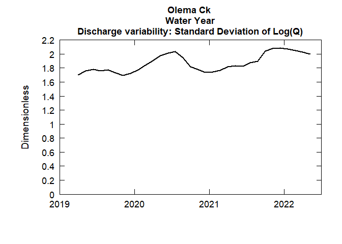<!-- -->

## 3.3 Seasonal Plots

These figures divide the data into the four seasons, and then visualize
the lowess for each one separately for 7-day minimum, Mean, and 1-day
maximum. There are a lot plots, but these can help diagnose if there are
seasonal trends in any of the discharge statistics that are not apparent
in the annual plots (Hirsch & De Cicco, 2015). If any show trends of
note, further analyses can be conducted on the particular season of
interest.

\newpage

<!-- -->

\newpage

## 3.4 Quantile-Kendall results

The following graph is a Quantile-Kendall plot. This graph visualizes
both the trend slope AND the p-value for each flow quantile (ranging
from the annual minimum and all the way to the annual maximum).
Therefore, it shows the slope and p-value for a range of percentiles
(from minimum to maximum, a total of 365 order statistics, i.e. 365
points on the plot), in one figure. The y-axis provides the trend
estimate (the percent change positive or negative per year) and the
color of each point gives the Mann-Kendall p-value.

A table with the p-values less than 0.1 is also provided below the
Quantile-Kendall plot so that the exact slope, p-value, and change over
the record can be reported.

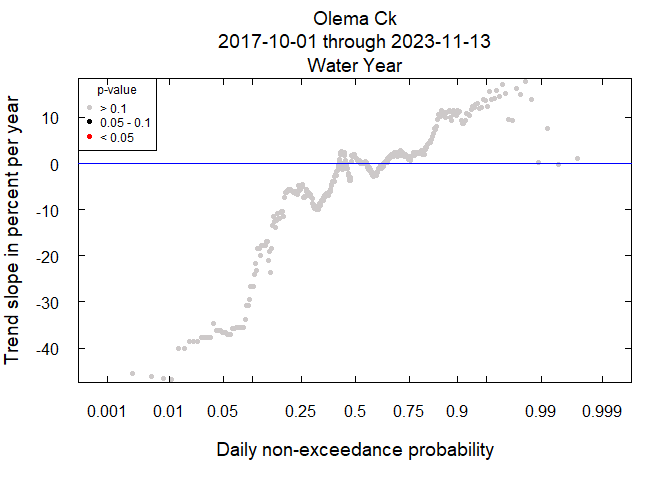<!-- --><table class="table" style="margin-left: auto; margin-right: auto;">
<caption>Quantile-Kendall Slopes and P-Values for p&lt;0.1.</caption>
 <thead>
  <tr>
   <th style="text-align:right;"> Order Statistic </th>
   <th style="text-align:right;"> Adjusted P-value </th>
   <th style="text-align:right;"> Slope % Change per Year </th>
   <th style="text-align:right;"> Slope Percent Change over Record Length </th>
  </tr>
 </thead>
<tbody>
  <tr>
   <td style="text-align:right;"> 1 </td>
   <td style="text-align:right;"> 0.013 </td>
   <td style="text-align:right;"> -0.272 </td>
   <td style="text-align:right;"> -35.992 </td>
  </tr>
  <tr>
   <td style="text-align:right;"> 2 </td>
   <td style="text-align:right;"> 0.058 </td>
   <td style="text-align:right;"> -0.219 </td>
   <td style="text-align:right;"> -28.096 </td>
  </tr>
  <tr>
   <td style="text-align:right;"> 3 </td>
   <td style="text-align:right;"> 0.082 </td>
   <td style="text-align:right;"> -0.198 </td>
   <td style="text-align:right;"> -25.098 </td>
  </tr>
</tbody>
</table>

# 4. EGRET Daily Discharge Plots

## 4.1 Daily Discharge Plots

These plots show the daily discharge over the complete discharge record.
This can be a helpful way to visualize possible trends over time in
daily discharge (Hirsch & De Cicco, 2015).

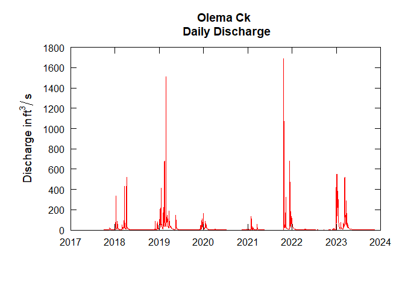<!-- -->

## 4.2 Daily Discharge Over the 95th Percentile

Next, the same type of plot is shown, but only with discharge values
above the 95th percentile. Recall above in Section 1 that the EGRET
`flowDuration()` function was run and to calculate the historical flow
at various percentiles. This function at default provides the discharge
at multiple percentiles for the whole year, which can then be indexed.
In this case, the 8th result of the vector `flow_percentiles[8]` will
serve as the 95th percentile and the lower bound on the discharge. Daily
discharge above the 95th percentile can then be displayed and examined
for potential trends (Hirsch & De Cicco, 2015).

*OPTIONAL*: If there are other lower bounds you are interested in, the
value of qLower can be adjusted.

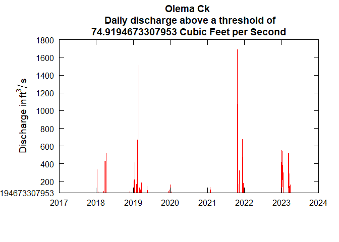<!-- -->

# 5. Peak Flow Plots

## 5.1 Peak Flow Trend Plot: Theil-Sen Median Line vs. Ordinary Least Squares Regression

The following code obtains the dates of peak flow for each year for the
full stream gage record from the NWIS web service. It converts the day
in the `peak_dt` column to the number of days since January 1st and
grabs the corresponding year. Then it plots these points for all years,
and fits/visualizes two different linear models to the data.

Both the Theil-Sen line and ordinary least squares (OLS) regression are
visualized. The function for this plot was adapted and modified from
Chapter 10.1 of *Statistical Methods in Water Resources* (Helsel et al.,
2020). OLS regression is one of the most commonly used linear models.
However, it is extremely susceptible to outliers, which can influence
the slope and significance test for OLS. OLS also assumes residuals are
distributed normally. Violations to OLS assumptions may occur in
discharge records. In the plot below, the data should generally behave
well, since dates are being regressed rather than discharge
measurements, but it is possible there may be an influential point or
two from years that had exceptionally wet or dry conditions. Theil-Sen
still assumes that there is a linear relationship present, but is
nonparametric. It is a model of the median. It therefore does not make
assumptions about the distribution and is less sensitive to outliers,
while still assuming a linear relationship. The presence of a linear
relationship should be verified by visually examining the scatter plots
before reporting significance tests.

This analysis can help determine whether there is a linear trend in the
peak flow over the record. For example, if the slope appears positive,
the date of peak flow is on average getting later each year, while a
negative slope would indicate that the date of peak flow is getting
earlier each year.

In cases where the assumptions for OLS regression are met, OLS is
slightly more efficient (lower root mean square error) than Theil-Sen.
Theil-Sen is far superior when these aren't met (Helsel et al., 2020).
Assuming a linear relationship, the Theil-Sen slope and significance
test should be reported if there are major questions about whether the
assumptions for OLS regression are met, especially if the trend lines
appear to vary quite a bit between the two models.


```
##     
##       Theil-Sen line 
##     
## Days Since October 1st = 433.134 -0.09278351 * Water Year 
##  
##        95 % Confidence interval on the slope 
## LCL =  -0.16  Theil slope =  -0.093  UCL =  -0.023 
## 
```

<!-- -->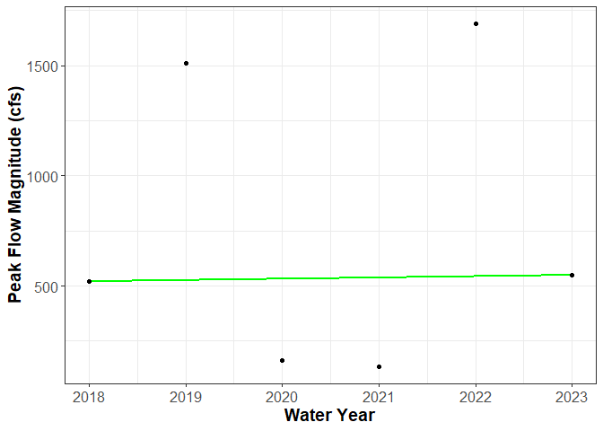<!-- -->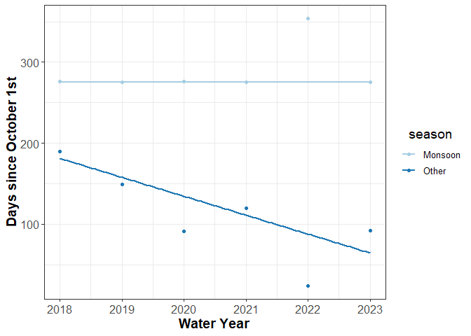<!-- --><!-- -->

<table class="table" style="width: auto !important; margin-left: auto; margin-right: auto;">
<caption>Theil-Sen P-value, Coefficients, and Confidence Interval Limits for Yellowstone River at Corwin Springs</caption>
 <thead>
  <tr>
   <th style="text-align:right;"> P-value </th>
   <th style="text-align:right;"> Slope </th>
   <th style="text-align:right;"> Estimated Change per Century (number of days) </th>
   <th style="text-align:right;"> Intercept </th>
   <th style="text-align:right;"> Lower Confidence Limit </th>
   <th style="text-align:right;"> Upper Confidence Limit </th>
  </tr>
 </thead>
<tbody>
  <tr>
   <td style="text-align:right;"> 0.007 </td>
   <td style="text-align:right;"> -0.093 </td>
   <td style="text-align:right;"> -9.278 </td>
   <td style="text-align:right;"> 433.134 </td>
   <td style="text-align:right;"> -0.16 </td>
   <td style="text-align:right;"> -0.023 </td>
  </tr>
</tbody>
</table>

## 5.2 Ordinary Least Squares Regression Assumptions and Statistics

The below plots are to check assumptions on the OLS model to see if it
is appropriate for peak flow. Plot 1: Checks linearity. Ensure that
there is not a relationship between the residuals and the fitted values
for our peak flow vs. year linear model. The points should all be evenly
spaced around zero, and there should not be an obvious relationship in
them (no curves, fanning out on either side, etc). Plot 2: Normal Q-Q is
used to check data normality. The residuals should follow the straight
dashed line. Plot 3: Scale-location can be used to check for homogeneity
of the residuals' variances. Should be relatively flat line with equally
spread points. Plot 4: Checks for outliers and influential points. If
there are points outside of the red hashed lines (these may not show up
if no points are influential), they impact the OLS model.

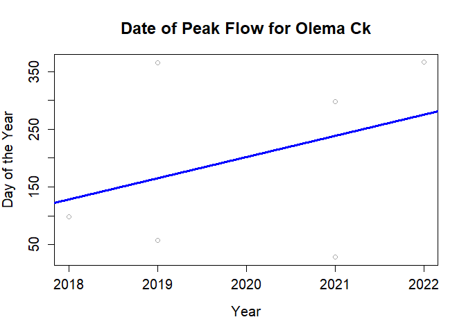<!-- -->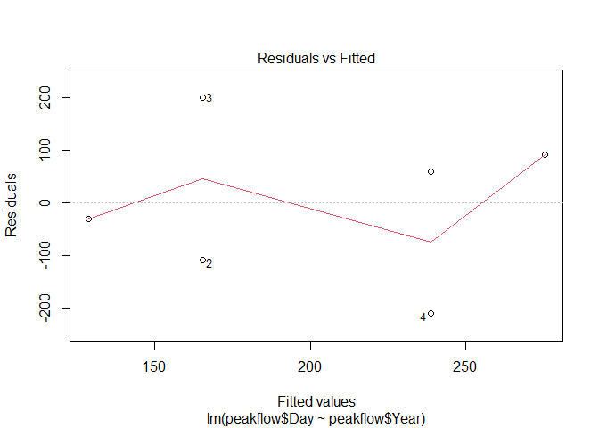<!-- -->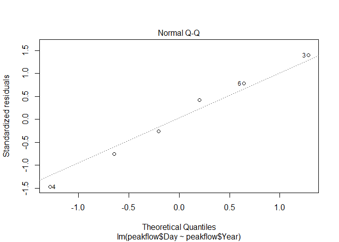<!-- -->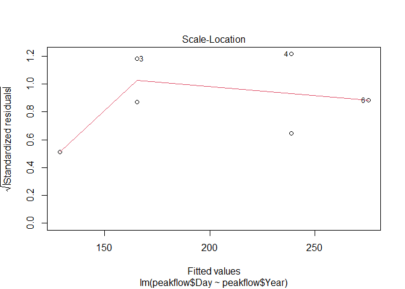<!-- -->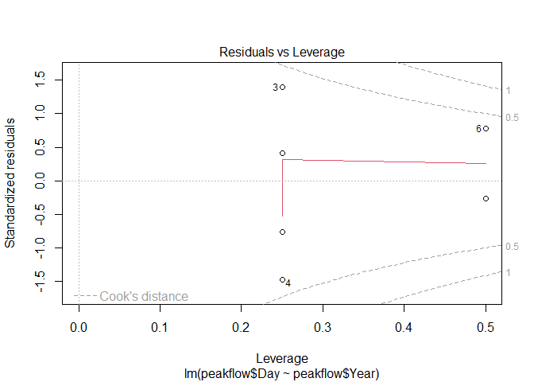<!-- -->

Finally, a significant trend in the OLS peak flow vs. year (i.e. is the
trend line fit above in dashed statistically significant). Below the
word `Coefficients`, there is a row titled `peakFlow$year`. This row
gives the slope estimate, `Estimate`, and p-value, `Pr(>|t|)`. If the
value of `Pr(>|t|)` for peakFlow\$year is less than 0.05, this suggests
that it is highly likely there is a trend in peak flow.


```
## 
## Call:
## lm(formula = peakflow$Day ~ peakflow$Year)
## 
## Residuals:
##     Min      1Q  Median      3Q     Max 
## -33.784  -7.914   1.148   7.530  29.902 
## 
## Coefficients:
##                Estimate Std. Error t value Pr(>|t|)    
## (Intercept)   335.66417   64.35911   5.215 6.85e-07 ***
## peakflow$Year  -0.08991    0.03276  -2.745   0.0069 ** 
## ---
## Signif. codes:  0 '***' 0.001 '**' 0.01 '*' 0.05 '.' 0.1 ' ' 1
## 
## Residual standard error: 12.66 on 133 degrees of freedom
## Multiple R-squared:  0.0536,	Adjusted R-squared:  0.04648 
## F-statistic: 7.533 on 1 and 133 DF,  p-value: 0.006897
```

# 6. References

## 6.1 Packages

1.  R: R Core Team (2021). R: A language and environment for statistical
    computing. R Foundation for Statistical Computing, Vienna, Austria.
    URL <https://www.R-project.org/.>

2.  dataRetrieval: De Cicco, L.A., Hirsch, R.M., Lorenz, D., Watkins,
    W.D., Johnson, M., 2022, dataRetrieval: R packages for discovering
    and retrieving water data available from Federal hydrologic web
    services, v.2.7.12, <doi:10.5066/P9X4L3GE>.

3.  EGRET: Hirsch, R.M., De Cicco, L.A., Murphy, J., 2023, Exploration
    and Graphics for RivEr Trends (EGRET), version 3.0.9,
    <doi:10.5066/P9CC9JEX>.

4.  Tidyverse: Wickham H, Averick M, Bryan J, Chang W, McGowan LD,
    François R, Grolemund G, Hayes A, Henry L, Hester J, Kuhn M,
    Pedersen TL, Miller E, Bache SM, Müller K, Ooms J, Robinson D,
    Seidel DP, Spinu V, Takahashi K, Vaughan D, Wilke C, Woo K, Yutani H
    (2019). "Welcome to the tidyverse." \_Journal of Open Source
    Software\_, \*4\*(43), 1686. doi: 10.21105/joss.01686 (URL:
    [https://doi.org/10.21105/joss.01686).](https://doi.org/10.21105/joss.01686).).

5.  rkt: Aldo Marchetto (2021). rkt: Mann-Kendall Test, Seasonal and
    Regional Kendall Tests. R package version 1.6.
    <https://CRAN.R-project.org/package=rkt>.

6.  zyp: David Bronaugh and Arelia Schoeneberg (2023). zyp: Zhang +
    Yue-Pilon Trends Package. R package version 0.11-1.
    <https://CRAN.R-project.org/package=zyp>.

7.  lubridate: Garrett Grolemund, Hadley Wickham (2011). Dates and Times
    Made Easy with lubridate. Journal of Statistical Software, 40(3),
    1-25. URL <https://www.jstatsoft.org/v40/i03/.>.

8.  kableExtra: Hao Zhu (2021). kableExtra: Construct Complex Table with
    'kable' and Pipe Syntax. R package version 1.3.4.
    <https://CRAN.R-project.org/package=kableExtra>.

9.  scales: Hadley Wickham and Dana Seidel (2022). scales: Scale
    Functions for Visualization. R package version 1.2.1.
    <https://CRAN.R-project.org/package=scales>.

## 6.2 Literature References

1.  Cade, B.S. and Noon, B.R., 2003. A gentle introduction to quantile
    regression for ecologists. *Frontiers in Ecology and the
    Environment*, *1*(8), pp.412-420.

2.  Gannon, J.P, 9-Flow-Duration-Curves, 2021, Github repository,
    <https://github.com/VT-Hydroinformatics/9-Flow-Duration-Curves.git>.

3.  Helsel, D.R., Hirsch, R.M., Ryberg, K.R., Archfield, S.A., and
    Gilroy, E.J., 2020, Statistical methods in water resources: U.S.
    Geological Survey Techniques and Methods, book 4, chap. A3, 458 p.,
    <https://doi.org/10.3133/tm4a3>. [Supersedes USGS Techniques of
    Water-Resources Investigations, book 4, chap. A3, version 1.1.].

4.  Hirsch, R.M., and De Cicco, L.A., 2015, User guide to Exploration
    and Graphics for RivEr Trends (EGRET) and dataRetrieval---R packages
    for hydrologic data (version 2.0, February 2015): U.S. Geological
    Survey Techniques and Methods book 4, chap. A10, 93 p.,
    <http://dx.doi.org/10.3133/tm4A10>.

5.  Hirsch, R.M., 2018 (updated 2023), Daily Streamflow Trend Analysis
    <https://waterdata.usgs.gov/blog/quantile-kendall/>.

6.  Hirsch, R.M., Moyer, D.L., and Archfield, S.A., 2010, Weighted
    Regressions on Time, Discharge, and Season (WRTDS), with an
    application to Chesapeake Bay River inputs: Journal of the American
    Water Resources Association, v. 46, no. 5, p. 857--880,
    <http://onlinelibrary.wiley.com/doi/10.1111/j.1752-1688.2010.00482.x/full>.

7.  Searcy, J.K., 1959, Flow-duration curves: Water Supply Paper 1542A,
    accessed at <http://pubs.er.usgs.gov/publication/wsp1542A>.

# 7. Supplemental Information

## 7.1 Discharge Distributions

Below shows the historical distribution of the daily discharge data, and
the corresponding empirical cumulative distribution function. This code
was adapted from a Hydroinformatics repository (Gannon, 2021). The red
lines show the median of the daily discharge data from the full record.


```
## Warning: The dot-dot notation (`..count..`) was deprecated in ggplot2 3.4.0.
## ℹ Please use `after_stat(count)` instead.
## This warning is displayed once every 8 hours.
## Call `lifecycle::last_lifecycle_warnings()` to see where this warning was
## generated.
```

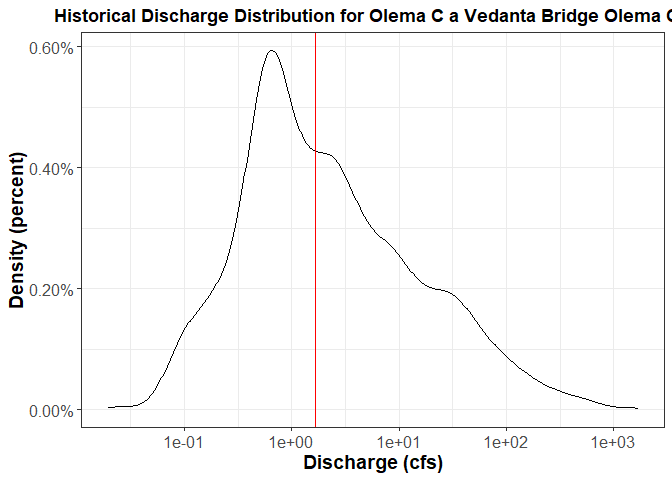<!-- -->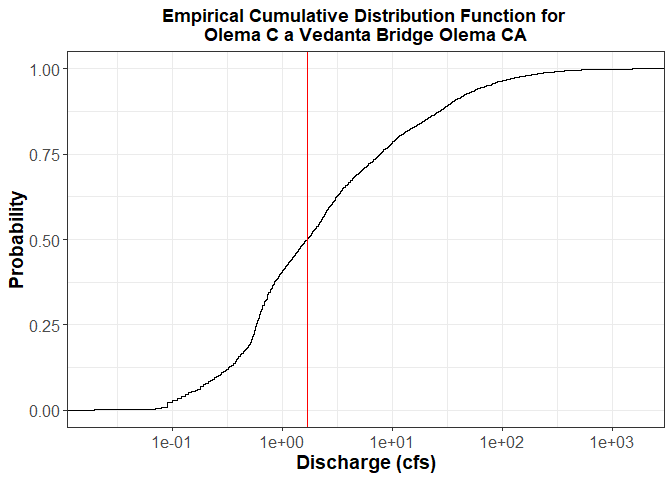<!-- -->


------------------------------------------------------------------------

Note, to convert this entire Rmd to a plain old R script the following
commands can be run by supplying the file path to this Rmd file on your
local device:


```r
library(knitr)
rmd_file <- "flowtrends.Rmd"
knitr::purl(rmd_file)
```

---
title: ""
subtitle: "Longterm Flow Analysis, updated 2023-08-22"
author: "Abby Volk, Ally Mars, Andy Ray, Jana Cram, Ben LaFrance"
date: "2024-03-07"
---
